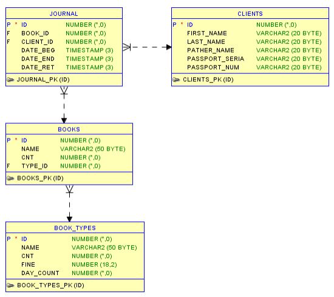

# Simple library management system

Library management system is made to manage a simple library that can be stored in a database with following scheme:

  

System consists of rest api and graphical user interface. Rest api allows to make changes to the library data. Graphical user interface provides a convenient way to send requests to the rest api.